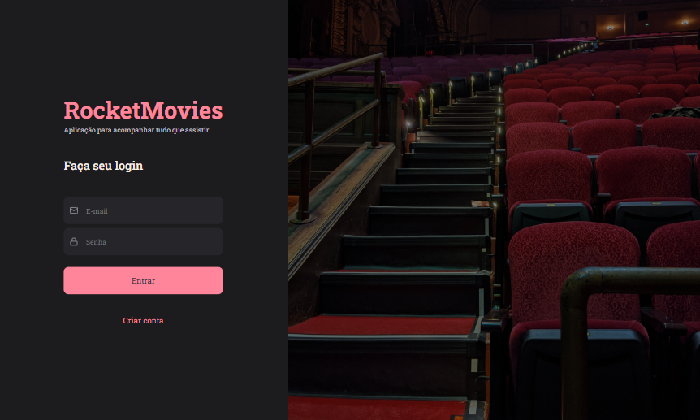
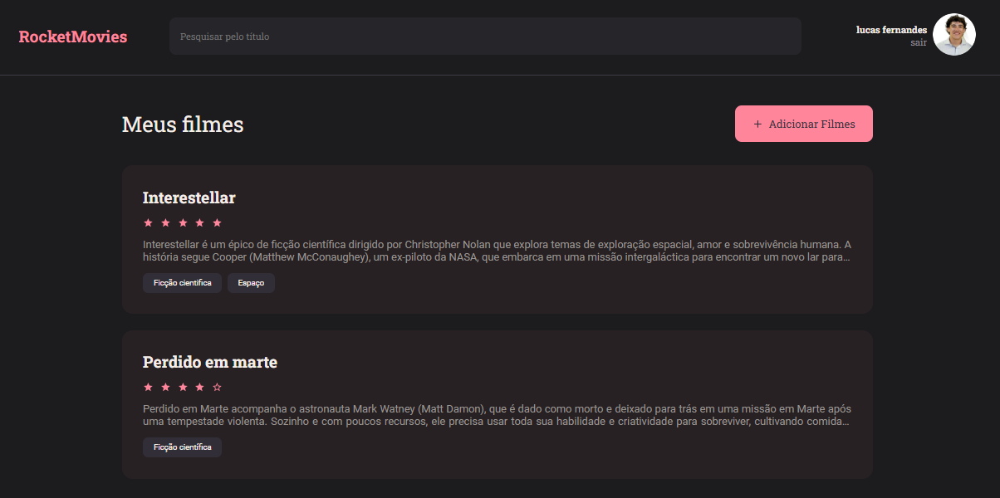

<h1 align="center"> RocketMovies </h1>

RocketMovies is a complete web application for managing favorite movies, consisting of frontend and backend, where users can register and log in, create and manage notes about their favorite movies.  
This project was developed with Node.js, React and SQLite.

  <a href="#Technologies">Technologies</a>&nbsp;&nbsp;&nbsp;|&nbsp;&nbsp;&nbsp;
  <a href="#Project">Project</a>&nbsp;&nbsp;&nbsp;|&nbsp;&nbsp;&nbsp;
  <a href="#Link-to-view">Link to view</a>&nbsp;&nbsp;&nbsp;|&nbsp;&nbsp;&nbsp;
  <a href="#Link-to-view-backend-code">Link to view backend code</a>&nbsp;&nbsp;&nbsp;|&nbsp;&nbsp;&nbsp;
  <a href="#memo-license">License</a>

  

  
<h1 align="center">
  
</h1>

<h1 align="center">
  
</h1>

  
<h2 align="left" id="Technologies"> &nbsp;&nbsp; Technologies </h2>

This project was developed with the following technologies:
- [Node.js] Backend, managing authentication and note storage
- [React] Frontend of the application, responsible for user interactions
- [SQLite] Database used to store note data
- [LocalStorage] User data storage for session persistence

  
<h2 align="left" id="Project"> &nbsp;&nbsp; Project </h2>

  The RocketMovies app offers a complete experience for users who want to organize and share their favorite movies. Some of the features include:

  - User Registration and Login: Users can register and log in with their email and password, with the authentication data stored securely. 
  - Session Persistence: Login data is stored in LocalStorage so that the user remains logged in even when refreshing the page. 
  - Note Creation: Users can create personalized notes for each movie of their choice, adding information such as title, description and additional notes. 
  - Navigation: The app includes several pages to enhance the user experience: 
  &nbsp;&nbsp; > Signup Page: Interface for creating a new user account. 
  &nbsp;&nbsp; > Signin Page: Interface for the user to log in to the account with email and password. 
  &nbsp;&nbsp; > Home: Home page with summary of movie notes. 
  &nbsp;&nbsp; > Note Creation Page: Form to add a new movie note. 
  &nbsp;&nbsp; > Details Page: Displays full details of movie notes created by the user. 
  &nbsp;&nbsp; > Profile page: Allows updating of user data. 
  
  

  
<h2 align="left" id="Link-to-view"> &nbsp;&nbsp;   Link to view </h2>

[RocketMovies](https://notesaboutmovies.netlify.app/)

  
<h2 align="left" id="Link-to-view-backend-code"> &nbsp;&nbsp;   Link to view backend code </h2>

[Backend Code](https://github.com/lucasfernandesm/Rocket-Movies-API)

  
## :memo: License

This project is under the MIT license.

---
